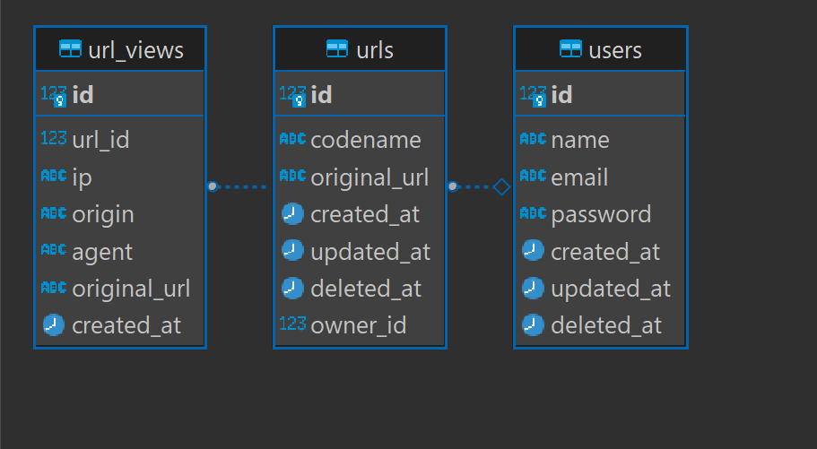

## Encurtador de Urls

#### Autor

- [Israel Morais](https://www.linkedin.com/in/israel-morais-a3b20b173/)

## Descrição

### Solução

Para o teste prático para desenvolvedor back-end Teddy Open Finance, foi feito um sistema de encurtamentos de urls. O código fonte foi estruturado em um monorepo e pensado para uma arquitetura de microserviços.

O projeto é constituído de 2 apps (microserviços) que devem ser responsáveis pelos objetos de seus domínios. São eles:

- urls -> microserviço responsável pelo CRUD de urls e registrar as visualizações.
- users -> microserviço responsável por cadastrar e autenticar usuários

Para ganhar tempo, realizei as seguintes abordagens:

- Os serviços compartilham o mesmo banco e as migrações são centralizadas (sei que em um cenário ideal cada serviço deveria ter o proprio mecanismo de persistência).

- Cada serviço possui a própria documentação (daria para mergear todas usando os endpoints que retornam o schema em json/yaml mas considerei que isso teria menos peso do que a funcionalidade em si).

O esquema DDL ficou assim:



### Principais Ferramentas

- Linguagem:

  - Node.js

- Frameworks/Libs:

  - NestJS
  - Fastify
  - Typeorm
  - Swagger / OpenAPI

- Banco de dados:

  - Postgres

- Conteinerização

  - Docker
  - Docker Compose

- Padrões
  - Monorepo
  - SOLID

## Pré requisitos

Para rodar o projeto deverá possuir o Docker Compose instalado.

## Como rodar

Clonar o repositório

```bash
git clone https://github.com/israel-bruno/teddy-url-shortener.git
```

Acessar a pasta do projeto

```bash
cd teddy-url-shortener
```

Executar o Docker Compose

```bash
docker-compose --env-file=.env.example up
```

## Como testar

Como dito anteriormente, cada serviço expõe a própria documentação:

[Documentação de users](http://localhost:3001/api/docs)

[Documentação de urls](http://localhost:3000/api/docs)
